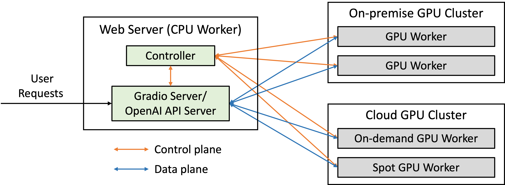

# FastChat-Doc

FastChat is an open-source platform designed for training, serving, and evaluating large language models (LLMs) for chatbot applications. It offers a comprehensive set of features that cater to various needs, making it a popular choice for LLM developers and enthusiasts.

Here's a breakdown of its key aspects:

**Core Features:**

* **Pre-trained Models:** FastChat comes with pre-trained weights and training/evaluation code for state-of-the-art models like Vicuna and FastChat-T5. These models are known for their impressive performance in chatbot tasks.
* **Multi-Model Serving System:** FastChat boasts a distributed multi-model serving system with a user-friendly web interface and OpenAI-compatible RESTful APIs. This allows you to easily deploy and manage multiple LLM models simultaneously.
* **OpenAI Compatibility:** The OpenAI-compatible APIs make FastChat a seamless drop-in replacement for OpenAI in existing applications. This simplifies integration and leverages familiar tools and workflows.
* **Chatbot Arena:** FastChat powers Chatbot Arena, a platform for hosting LLM battles and comparing their performance through user votes. This fosters a competitive environment for LLM development and provides valuable insights for researchers and developers.

**Benefits of using FastChat:**

* **Flexibility:** Train, serve, and evaluate diverse LLM models with a single platform.
* **Ease of Use:** The web UI and OpenAI compatibility make interaction intuitive and effortless.
* **Scalability:** The distributed architecture allows for handling large volumes of chat requests efficiently.
* **Openness:** The open-source nature fosters community contributions and continuous improvement.

## Install

### Method 1: With pip

```bash
pip3 install "fschat[model_worker,webui]"
```

### Method 2: From source

1. Clone this repository and navigate to the FastChat folder
```bash
git clone https://github.com/lm-sys/FastChat.git
cd FastChat
```

If you are running on Mac:
```bash
brew install rust cmake
```

2. Install Package
```bash
pip3 install --upgrade pip  # enable PEP 660 support
pip3 install -e ".[model_worker,webui]"
```

#### Single GPU
The command below requires around 14GB of GPU memory for Vicuna-7B and 28GB of GPU memory for Vicuna-13B.
See the ["Not Enough Memory" section](#not-enough-memory) below if you do not have enough memory.
`--model-path` can be a local folder or a Hugging Face repo name.
```
python3 -m fastchat.serve.cli --model-path lmsys/vicuna-7b-v1.5
```

#### Multiple GPUs
You can use model parallelism to aggregate GPU memory from multiple GPUs on the same machine. 
```
python3 -m fastchat.serve.cli --model-path lmsys/vicuna-7b-v1.5 --num-gpus 2
```

Tips:
Sometimes the "auto" device mapping strategy in huggingface/transformers does not perfectly balance the memory allocation across multiple GPUs.
You can use `--max-gpu-memory` to specify the maximum memory per GPU for storing model weights.
This allows it to allocate more memory for activations, so you can use longer context lengths or larger batch sizes. For example,

```
python3 -m fastchat.serve.cli --model-path lmsys/vicuna-7b-v1.5 --num-gpus 2 --max-gpu-memory 8GiB
```

#### Not Enough Memory
If you do not have enough memory, you can enable 8-bit compression by adding `--load-8bit` to commands above.
This can reduce memory usage by around half with slightly degraded model quality.
It is compatible with the CPU, GPU, and Metal backend.

Vicuna-13B with 8-bit compression can run on a single GPU with 16 GB of VRAM, like an Nvidia RTX 3090, RTX 4080, T4, V100 (16GB), or an AMD RX 6800 XT.

```
python3 -m fastchat.serve.cli --model-path lmsys/vicuna-7b-v1.5 --load-8bit
```

## FastChat Server Architecture


## Serving with Web GUI


<a href="https://chat.lmsys.org"></a>
